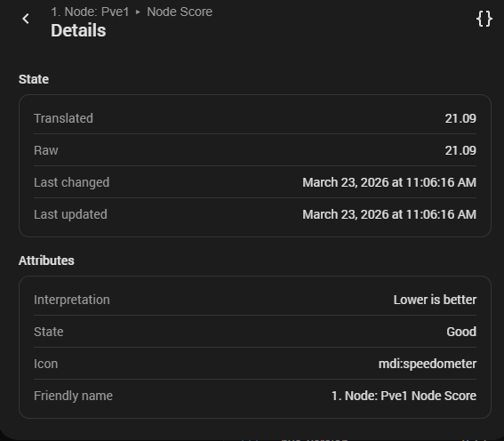
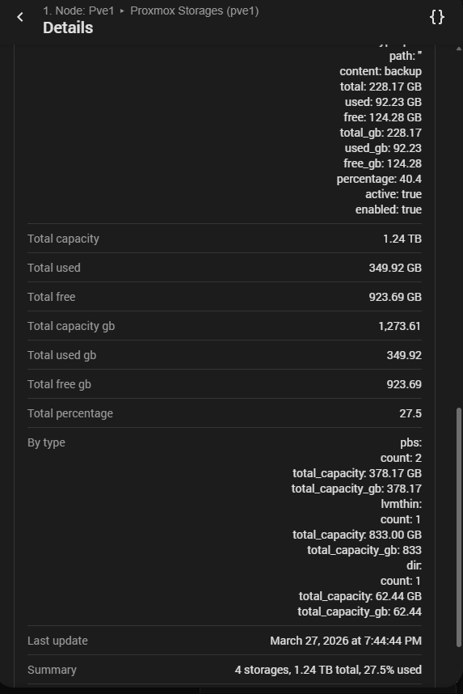
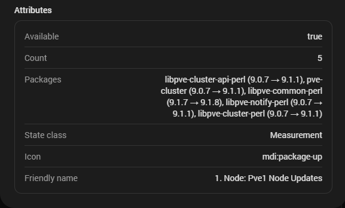
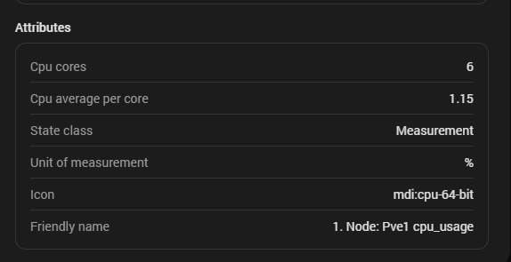
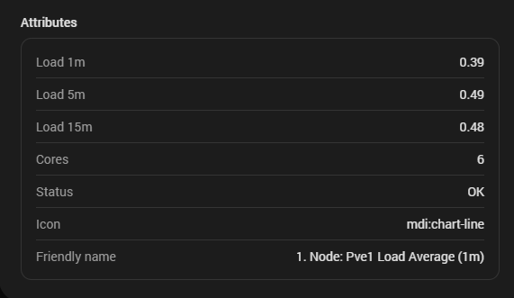
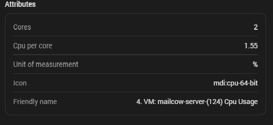
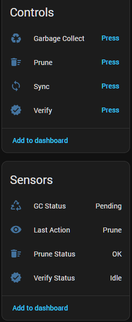

<p align="center">
  
</p>

> Advanced monitoring and control for Proxmox VE & PBS in Home Assistant

# 🚀 Proxmox Extended Sensors

## 🚀 Introduction

**Proxmox Extended Sensors is a Home Assistant integration designed to provide deep monitoring and control of Proxmox VE and Proxmox Backup Server (PBS).**

It goes beyond basic metrics by delivering **real insight into system state**, combining resource monitoring, task tracking, and infrastructure control in a single, clean integration.

With V3, the focus shifts from raw data to **meaningful information**, allowing you to understand not only what is happening, but also how your system is behaving.

---

## 🔍 Key Capabilities

* **Comprehensive monitoring of nodes**, VMs, CTs, storage, and PBS
* **System insight sensors** such as:
  * **Node Score** (overall load evaluation)
  * **Load Average**
  * **IO Wait** (disk pressure)
  * **Stress and overload detection**
* **Control actions** for VMs and containers (start, stop, reboot, etc.)
* **Integrated backup services** with flexible configuration
* **PBS support**, including datastore awareness and task tracking
* **Token-based authentication** for secure access
* **Clean and consistent entity structure**
* **Efficient data handling** with optimized updates

---

## 🧠 Why this integration
Instead of exposing only raw values, Proxmox Extended Sensors provides interpreted data that helps you:

* Detect system bottlenecks (CPU, disk, load)
* Understand real node usage
* Build smarter automations
* Make better decisions when managing workloads

---

## 🔗 Backup Integration

Backups triggered from Home Assistant are fully compatible with Proxmox VE and PBS, using identifiable naming such as:
```
HA-{{vmid}}-{{guestname}}
```

All PBS features remain intact, including deduplication and existing backup chains.

---

## 🎯 Summary

This integration turns Home Assistant into a centralized control and monitoring panel for Proxmox, combining:

* Real system visibility
* Smart sensors
* Infrastructure control
* Automation-ready data

---

## 📚 Documentation & Guides

**Select your language to start the installation and configuration:**

[](docs/en/README.md)
[](docs/es/README.md)
[](docs/it/README.md)
[](docs/fr/README.md)
[](docs/de/README.md)
[](docs/nl/README.md)
[](docs/pt/README.md)
[](docs/ru/README.md)
[](docs/uk/README.md)

---

## 🧩 Supported Versions

- Proxmox VE 7.x / 8.x / 9.x
- Proxmox Backup Server 3.x / 4.x  
- Home Assistant 2024.x+ (2026.3+ recommended for full UI features)  

---

## 📑 Table of Contents

- [Key Features](#-key-features-v300)
- [Node Status & Performance](#-node-status--performance)
- [Disks & SMART](#-disks--smart)
- [Virtual Machines (QEMU)](#-virtual-machines-qemu)
- [Containers (LXC)](#-containers-lxc)
- [Backup Services](#-backup-services-vms--cts)
- [Proxmox Backup Server (PBS)](#-proxmox-backup-server-pbs)
- [Control Actions (PVE & PBS)](#-control-actions-pve--pbs)
- [Installation](#-installation)
- [Visual Setup Guide](#-visual-setup-guide)
- [Contributing](#-contributing--community)

---

## 🔥 Key Features (v3.0.0)

### 🧠 System Insight (NEW in V3)

***Move from raw metrics to real system understanding.***

* Node Score (overall node performance evaluation)
* Load Average (1m, 5m, 15m)
* IO Wait (disk pressure detection)
* Node Stress detection
* Disk overload detection
* CPU cores + per-core usage (Node / VM / CT)

## ⚙️ Improved Setup Experience (NEW in V3)

- Automatic node discovery  
- Optional manual node selection from detected nodes  
- No need to manually enter node names  

---

### 🌡️ Advanced Hardware Monitoring (PVE & PBS)

- **Real‑time temperatures:** CPU cores, VRM, chipset, NVMe/SSD/HDD.
- **Mechanical sensors:** Fan speeds (RPM), voltages and other board sensors.
- **Smart filtering:** Only entities with valid data are created to keep your system clean.
- **Unified temperature sensors (CPU + NVMe)**
  > Requires `lm-sensors` on the Proxmox host.

---

### 🧠 Node Status & Performance

- CPU, RAM, uptime, kernel & PVE version  
- Network monitoring (RX/TX)  
- Tasks and system status

<details>
  <summary>🔳 Node Attributes</summary>
  <p align="center">
    
  </p>
</details>

<details>
  <summary>⭕ Node Controls</summary>
  <p align="center">
    
  </p>
</details>

<details>
  <summary>🟢 Node Score</summary>
  <p align="center">
    
  </p>
</details>

<details>
  <summary>💾 Node Storage</summary>
  <p align="center">
    
  </p>
</details>

<details>
  <summary>🔄 Node Updates</summary>
  <p align="center">
    
  </p>
</details>

<details>
  <summary>🌡️ CPU Temperature</summary>
  <p align="center">
    
  </p>
</details>

<details>
  <summary>🌡️ Chipset Temperature</summary>
  <p align="center">
    
  </p>
</details>

<details>
  <summary>⏳ CPU I/O Wait</summary>
  <p align="center">
    
  </p>
</details>

<details>
  <summary>⏳ CPU Usage</summary>
  <p align="center">
    
  </p>
</details>

<details>
  <summary>⏳ Load Average</summary>
  <p align="center">
    
  </p>
</details>


---

### 💾 Disks & SMART

- Physical disk sensors grouped as dedicated devices.
- Total/used space, wear level (NVMe), and more.
- SMART‑related attributes for HDD/SSD/NVMe (where available).
- Dedicated temperature sensors per disk type (SATA, NVMe, etc.).

<details>
  <summary>💾 Disk Sensors</summary>
  <p align="center">
    
  </p>
</details>

<details>
  <summary>🩺 HDD/SSD SMART Attributes</summary>
  <p align="center">
    
  </p>
</details>

<details>
  <summary>🩺 NVMe SMART Attributes</summary>
  <p align="center">
    
  </p>
</details>

---

### 🖥️ Virtual Machines (QEMU)

- Status, CPU usage, memory used/total, disk used/total.
- Network RX/TX per VM.
- Uptime and basic info sensors.
- Clean device grouping per VM in Home Assistant.
- CPU cores and per-core usage

<details>
  <summary>🖥️ VM Controls & Sensors</summary>
  <p align="center">
    
  </p>
</details>

<details>
  <summary>🖥️ VM CPU Usage</summary>
  <p align="center">
    
  </p>
</details>

---

### 📦 Containers (LXC)

- Status, CPU usage, memory used/total, disk used/total.
- Network RX/TX per container.
- Uptime and basic info sensors.
- Same clean device structure as VMs.
- CPU cores and per-core usage

<details>
  <summary>📦 Container Controls & Sensors</summary>
  <p align="center">
    
  </p>
</details>

---

## 💾 Backup Services (VMs & CTs)

The integration includes two powerful backup services that allow you to create **Proxmox backups directly from Home Assistant**, fully compatible with Proxmox VE and Proxmox Backup Server (PBS).

---

### 🟦 Single Backup   
Creates a backup of one or multiple VMs or CTs.

💡 Supports batch backups using comma-separated VM/CT IDs

**Service:** `proxmox_sensors.create_vzdump_backup`

**Options available:**

- **Node** – Select the Proxmox node  
- **Target Storage** – Any storage supporting backups (local, NFS, PBS, etc.)  
- **VM/CT ID** – One or multiple IDs (comma-separated)  
  - Example: `100,114,118,125`  
- **Backup mode:**  
  - `snapshot`  
  - `suspend`  
  - `stop`  
- **Compression:**  
  - `zstd`  
  - `gzip`  
  - `lzo`  
  - `none`

Backups created from Home Assistant are automatically named using: HA-{{vmid}}-{{guestname}}


This ensures they are easy to identify while remaining **fully compatible with existing Proxmox backups**.

<details>
  <summary>📦 Single Backup Service</summary>
  <p align="center">
    
  </p>
</details>

---

### 🟩 Massive Backup  
Performs backups of **all VMs and/or CTs** on a selected node.

**Service:** `proxmox_sensors.backup_all`

**Options available:**

- **Node** – Select the node to back up  
- **Target Storage** – Any backup-capable storage  
- **Backup mode:** snapshot / suspend / stop  
- **Compression:** zstd / gzip / lzo / none  
- **Maximum concurrent backups** – Control parallel execution  
- **Delay between backups** – Seconds between each backup  
- **Include VMs** – Toggle  
- **Include CTs** – Toggle  

This service is ideal for scheduled nightly backups or automated maintenance routines.

<details>
  <summary>📦 Massive Backup Service</summary>
  <p align="center">
    
  </p>
</details>

---

### 🟧 PBS Compatibility & Deduplication

Backups created through these services:

- Are stored exactly like backups created from Proxmox VE  
- Use the same naming and metadata structure  
- Support **PBS deduplication** automatically  
- Integrate seamlessly with existing backup chains  
- Appear in the PBS datastore with full compatibility  

No special configuration is required — PBS handles deduplication and indexing exactly as if the backup were created from the Proxmox GUI or CLI.

---

### 🗄️ Proxmox Backup Server (PBS)

**Deep datastore and task monitoring:**

- Improved task analysis and filtering
- Datastore usage (GB and %), total, used and free.
- Deduplication ratio and backup count.
- Last backup time, size and status.
- Backup errors and backup summary.
- Garbage Collector (GC) status and related sensors.
- Last task: type, status, message and duration.

<details>
  <summary>🗄️ Datastore Overview</summary>
  <p align="center">
    
  </p>
</details>

<details>
  <summary>🗄️ PBS Server</summary>
  <p align="center">
    
  </p>
</details>

<details>
  <summary>🗄️ Task Details</summary>
  <p align="center">
    
  </p>
</details>

<details>
  <summary>🗄️ Garbage Collector Status</summary>
  <p align="center">
    
  </p>
</details>

<details>
  <summary>🗄️ Datastore Maintenance</summary>
  <p align="center">
    
  </p>
</details>

<details>
  <summary>🗄️ Last Task Summary</summary>
  <p align="center">
    
  </p>
</details>

---

### 🗄️ PBS Control Actions

- Run **Garbage Collector (GC)**.
- Run **Prune**.
- Run **Verify**.
- Run **Sync**.

<details>
  <summary>🗄️ Datastore Maintenance</summary>
  <p align="center">
    
  </p>
</details>

<details>
  <summary>🗄️ Last Task</summary>
  <p align="center">
    
  </p>
</details>

---

### 🎛️ Control Actions (PVE & PBS)

**Node controls:**

- Shutdown node.
- Reboot node.
- Wake-on-LAN (WOL)

**VM controls (QEMU):**

- Start, Stop, Shutdown, Reboot, Reset.
- Pause, Resume, Hibernate.

**Container controls (LXC):**

- Start, Stop, Shutdown, Reboot.

**PBS controls:**

- GC, Prune, Verify, Sync (per datastore).

---

### 🎨 Visual Organization & Naming

- Sensors automatically grouped into logical devices:
  1. Node  
  2. Physical disks  
  3. Virtual machines  
  4. Containers  
  5. Storages / Datastores  
  6. PBS server and tasks
- Consistent, clean naming for entities and devices to keep dashboards readable and scalable.

---

## 🧩 Installation

### 🔹 Via HACS (recommended)

1. Open **HACS → Integrations**.
2. Click the three dots (⋮) → **Custom repositories**.
3. Add this repository:
   - URL: `https://github.com/Javisen/proxmox_sensors`
   - Category: **Integration**
4. Search for **“Proxmox Extended Sensors”** in HACS and install it.
5. Restart Home Assistant.
6. Go to **Settings → Devices & Services → Add Integration** and search for **Proxmox Extended Sensors**.

### 🔹 Manual installation

1. Copy the folder `custom_components/proxmox_sensors` into:
   - `/config/custom_components/proxmox_sensors`
2. Restart Home Assistant.
3. Add the integration from **Settings → Devices & Services**.

---

## 🧭 Visual Setup Guide

Below is a complete visual walkthrough of the setup process, including login methods, resource selection, and configuration steps.

<details>
  <summary>🪪 Screenshot: Server Connection</summary>
  <p align="center">
    
  </p>
  > Do not include "http://" or "https://". This is handled automatically.
</details>

<details>
  <summary>🪪 Screenshot: Login with Username and Password (PVE only)</summary>
  <p align="center">
    
  </p>
  > Make sure to use the correct realm (`pam` or `pve`) depending on your user configuration.
</details>

<details> 
  <summary>🪪 Screenshot: Login with Username and Token (PVE & PBS)</summary>
  <p align="center">
    
  </p>
  > In the `Token_id` field, only the token name should be entered.
</details>

<details>
  <summary>🧠 Screenshot: Node Selection (V3)</summary>
  <p align="center">
    
  </p>
  <p align="center"><i>Select automatically detected nodes or manually define which ones to include.</i></p>
</details>

<details>
  <summary>⚙️ Screenshot: Resource Selection</summary>
  <p align="center">
    
  </p>
  > Select the CTs, VMs, and storages you want to include, along with the desired options.
</details>

---

**If you enjoy this integration or find it useful, please consider giving the project a ⭐ on GitHub.**  
**It helps visibility, motivates development, and supports future features.**

## 🤝 Contributing & Community

Contributions are welcome! Feel free to open issues or pull requests.  
**[Visit GitHub Repository](https://github.com/Javisen/proxmox_sensors)**

---

<p align="center"><i>Maintained by Javisen - MIT License</i></p>

