

  

# 🚀 Proxmox Extended Sensors

**The most comprehensive, efficient, and organized integration for monitoring and controlling Proxmox VE and Proxmox Backup Server (PBS) from Home Assistant.**

This integration is built for users who need **full visibility and control** over their Proxmox infrastructure without overloading the server.  
Unlike other solutions, **Proxmox Extended Sensors** focuses on:

- Energy‑efficient polling  
- Secure Token‑based authentication  
- Clean, logical and visually organized entities and devices  

---

## 📚 Documentation & Guides

**Select your language to start the installation and configuration:**

---

## 🧩 Supported Versions

- Proxmox VE 7.x / 8.x / 9.x
- Proxmox Backup Server 3.x / 4.x  
- Home Assistant 2024.x or newer  

---

  
🖼️ Dashboard Preview

  

  
  

  *Example of a modern dashboard using **Card-Mod** (Dark Mode) and our structured sensors:*

---

## 🔥 Key Features (v2.0.0)

### 🌡️ Advanced Hardware Monitoring (PVE & PBS)

- **Real‑time temperatures:** CPU cores, VRM, chipset, NVMe/SSD/HDD.
- **Mechanical sensors:** Fan speeds (RPM), voltages and other board sensors.
- **Smart filtering:** Only entities with valid data are created to keep your system clean.  
  > Requires `lm-sensors` on the Proxmox host.

---

### 🧠 Node Status & Performance

- CPU usage, I/O wait, load average.
- RAM total/used/free and percentage.
- Uptime and kernel/PVE version.
- Network RX/TX sensors for node, VMs and containers.

  
🔳 Node Attributes

  

    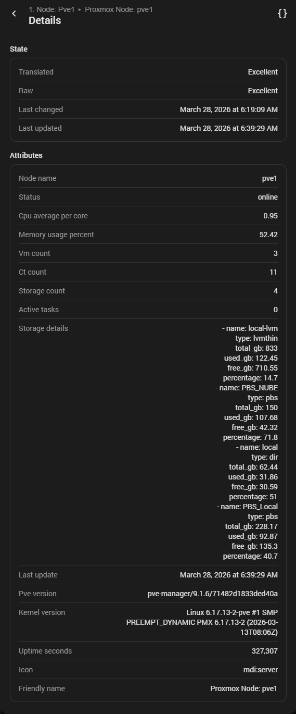
  

  
⭕ Node Controls

  

    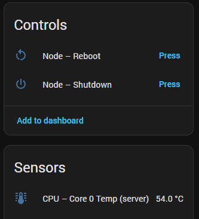
  

  
🌡️ CPU Temperature

  

    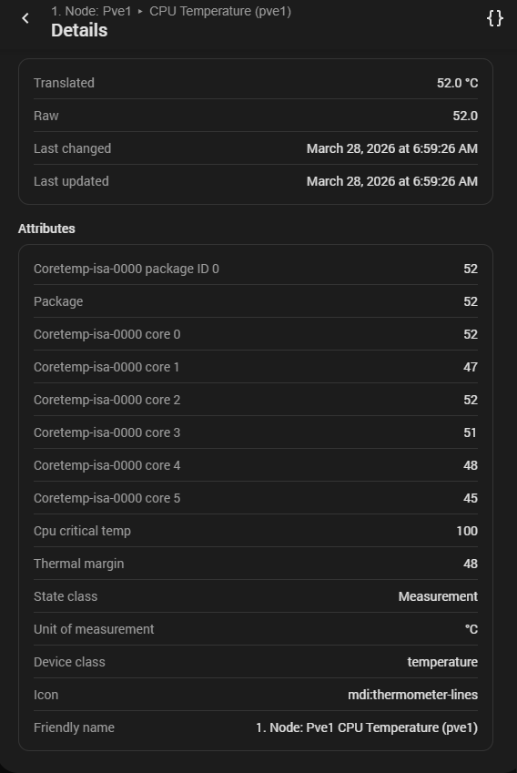
  

  
🌡️ Chipset Temperature

  

    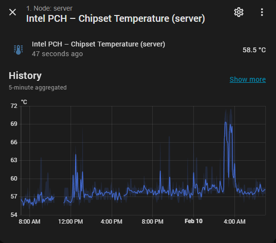
  

  
⏳ CPU I/O Wait

  

    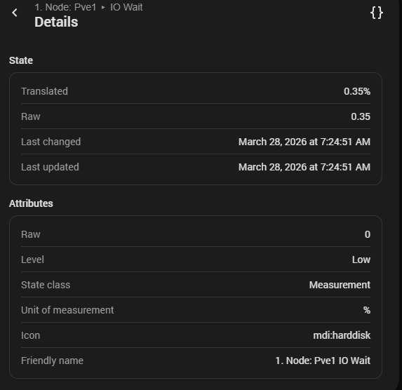
  

---

### 💾 Disks & SMART

- Physical disk sensors grouped as dedicated devices.
- Total/used space, wear level (NVMe), and more.
- SMART‑related attributes for HDD/SSD/NVMe (where available).
- Dedicated temperature sensors per disk type (SATA, NVMe, etc.).

  
💾 Disk Sensors

  

    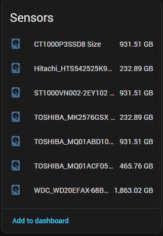
  

  
🩺 HDD/SSD SMART Attributes

  

    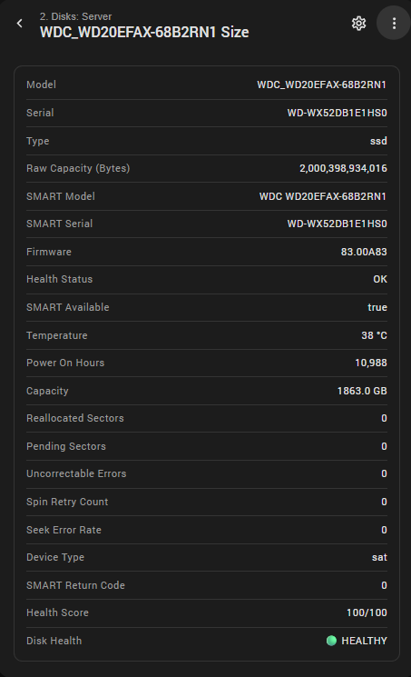
  

  
🩺 NVMe SMART Attributes

  

    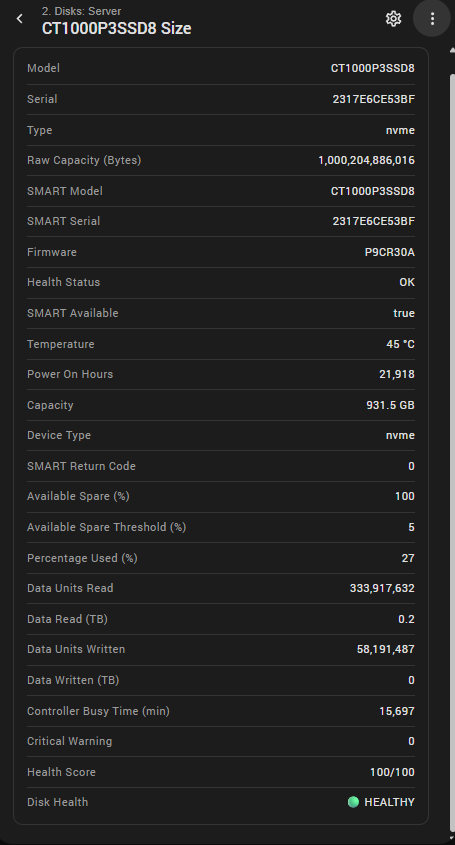
  

---

### 🖥️ Virtual Machines (QEMU)

- Status, CPU usage, memory used/total, disk used/total.
- Network RX/TX per VM.
- Uptime and basic info sensors.
- Clean device grouping per VM in Home Assistant.

  
🖥️ VM Controls & Sensors

  

    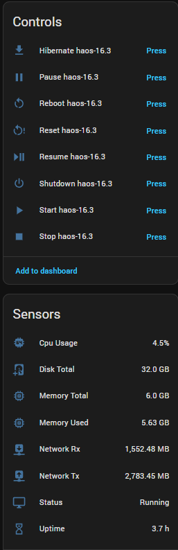
  

---

### 📦 Containers (LXC)

- Status, CPU usage, memory used/total, disk used/total.
- Network RX/TX per container.
- Uptime and basic info sensors.
- Same clean device structure as VMs.

  
📦 Container Controls & Sensors

  

    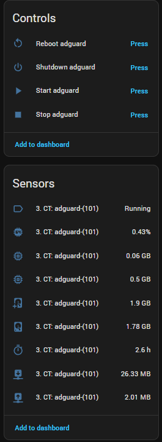
  

---

### 🗄️ Proxmox Backup Server (PBS)

**Deep datastore and task monitoring:**

- Datastore usage (GB and %), total, used and free.
- Deduplication ratio and backup count.
- Last backup time, size and status.
- Backup errors and backup summary.
- Garbage Collector (GC) status and related sensors.
- Last task: type, status, message and duration.

  
🗄️ Datastore Overview

  

    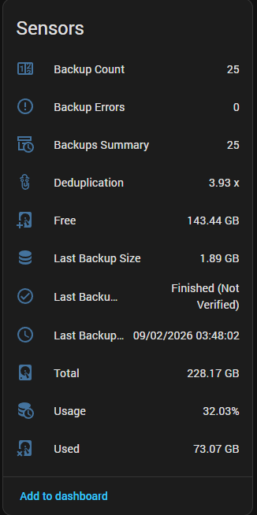
  

  
🗄️ PBS Server

  

    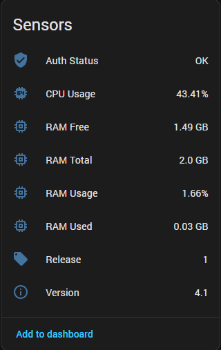
  

  
🗄️ Task Details

  

    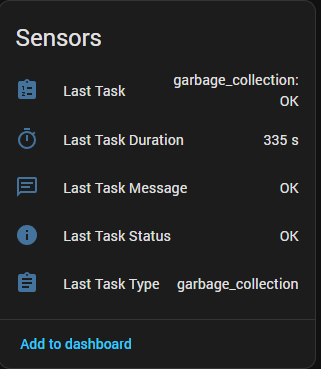
  

  
🗄️ Garbage Collector Status

  

    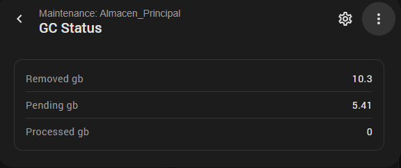
  

  
🗄️ Datastore Maintenance

  

    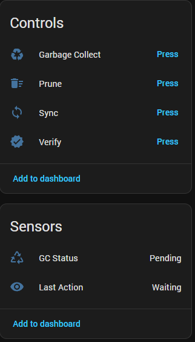
  

  
🗄️ Last Task Summary

  

    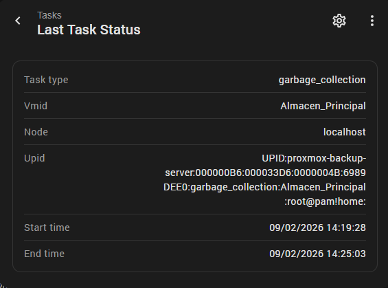
  

---

**PBS control actions:**

- Run **Garbage Collector (GC)**.
- Run **Prune**.
- Run **Verify**.
- Run **Sync**.

  
🗄️ Dtatastore Maintenance

  

    
  

  
🗄️ Last Task

  

    
  

---

### 🎛️ Control Actions (PVE & PBS)

**Node controls:**

- Shutdown node.
- Reboot node.

**VM controls (QEMU):**

- Start, Stop, Shutdown, Reboot, Reset.
- Pause, Resume, Hibernate.

**Container controls (LXC):**

- Start, Stop, Shutdown, Reboot.

**PBS controls:**

- GC, Prune, Verify, Sync (per datastore).

---

### 🎨 Visual Organization & Naming

- Sensors automatically grouped into logical devices:
  1. Node  
  2. Physical disks  
  3. Virtual machines  
  4. Containers  
  5. Storages / Datastores  
  6. PBS server and tasks
- Consistent, clean naming for entities and devices to keep dashboards readable and scalable.

---

## 🧩 Installation

### 🔹 Via HACS (recommended)

1. Open **HACS → Integrations**.
2. Click the three dots (⋮) → **Custom repositories**.
3. Add this repository:
   - URL: `https://github.com/Javisen/proxmox_sensors`
   - Category: **Integration**
4. Search for **“Proxmox Extended Sensors”** in HACS and install it.
5. Restart Home Assistant.
6. Go to **Settings → Devices & Services → Add Integration** and search for **Proxmox Extended Sensors**.

### 🔹 Manual installation

1. Copy the folder `custom_components/proxmox_sensors` into:
   - `/config/custom_components/proxmox_sensors`
2. Restart Home Assistant.
3. Add the integration from **Settings → Devices & Services**.

---

## 🧭 Visual Setup Guide

Below you can find a complete visual walkthrough of the setup process, including login methods, resource selection, and configuration steps.

  
🪪 Captura: Server Connection

  

    
  

  > No se usa "http://" ni "https://". Ya lo hacemos por tí.

  
🪪 Captura: Loguin mediante User y Password (solo PVE)

  

    
  

  > Asegúrate de usar el reino `pam` o `pve` según tu configuración de usuario.

 
  
🪪 Captura: Loguin mediante User y Token (PVE y PBS)

  

    
  

  **En el campo Token_id solo se debe poner el nombre del token**

  
⚙️ Captura: Resources Selection

  

    
  

  *Nota: Selecciona los CTs, VMs y Storages que quieres añadir así como las opciones*

---

**If you enjoy this integration or find it useful, please consider giving the project a ⭐ on GitHub.**  
**It helps visibility, motivates development, and supports future features.**

## 🤝 Contributing & Community

Contributions are welcome! Feel free to open issues or pull requests.  
**[Visit GitHub Repository](https://github.com/Javisen/proxmox_sensors)**

---

<i>Maintained by Javisen - MIT License</i>

