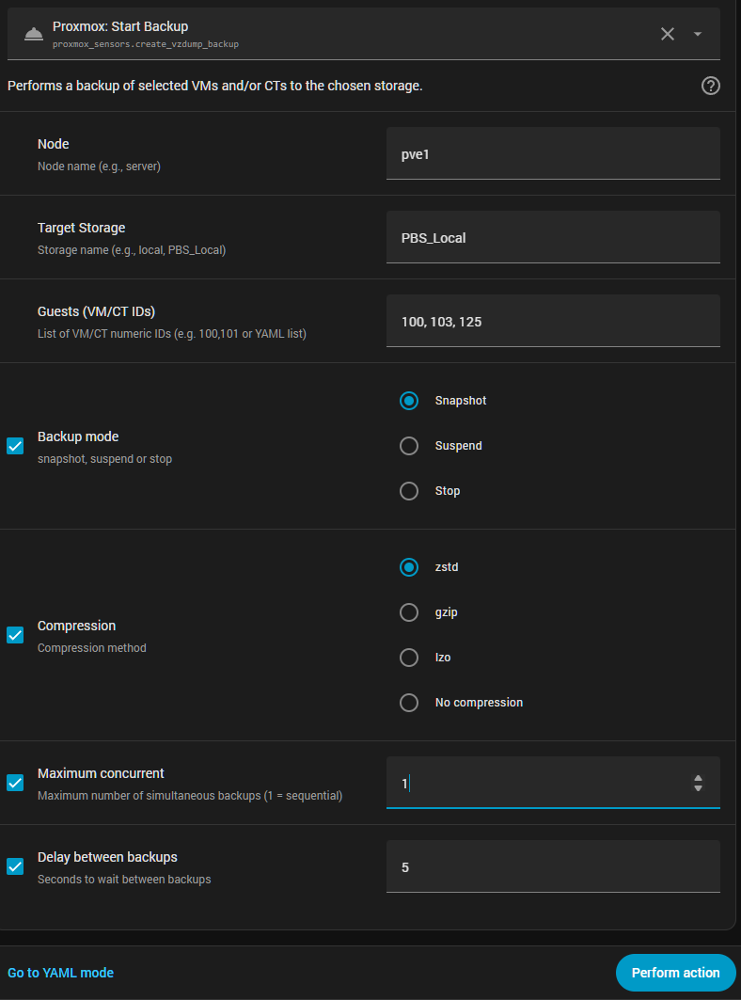
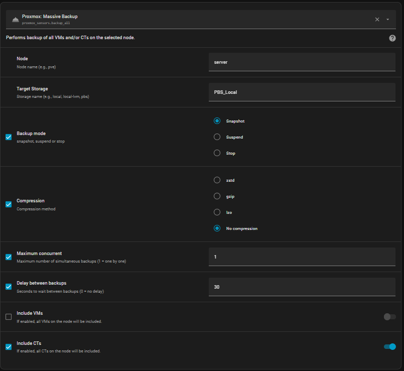

# 📚 Documentación y Guías

Para asegurar una configuración sin problemas, por favor sigue estas guías paso a paso:

---

## 🌡️ [01. Configuración de Sensores de Hardware](01-install-sensors.md)
Cómo instalar y configurar **lm-sensors** en tu nodo Proxmox para habilitar el monitoreo de temperatura y ventiladores.

---

## 🔑 [02. Configuración de Proxmox](02-proxmox-config.md)
Cómo crear un **usuario** y un **API Token** seguros en Proxmox (PVE y PBS) con los permisos mínimos necesarios.

---

## ⚙️ [03. Inicio de Sesión de la Integración (PVE y PBS)](03-login-pve-pbs.md)
Guía a través de la configuración inicial en Home Assistant y la conexión a tus servidores.

---

## ❓ [04. Preguntas Frecuentes y Solución de Problemas](04-faq.md)
Preguntas comunes, problemas conocidos y cómo solucionarlos.

---

  

---

# 🚀 Proxmox Extended Sensors

## Introducción

**Proxmox Extended Sensors es la integración más completa, eficiente y avanzada para Home Assistant, diseñada para proporcionar un control real y un monitoreo profundo de Proxmox VE y Proxmox Backup Server (PBS).**

Esta integración va mucho más allá de la simple visualización de datos: ofrece **visibilidad total** de tu infraestructura y añade **capacidades de control real**, permitiéndote gestionar nodos, máquinas virtuales, contenedores, discos, datastores y tareas de PBS directamente desde Home Assistant.

A diferencia de otras soluciones, Proxmox Extended Sensors está construida con un enfoque profesional:

- **Monitoreo avanzado** de hardware, VMs, CTs, discos y PBS.
- **Acciones de control total** (iniciar, detener, apagar, reiniciar, resetear, pausar, hibernar…).
- **Servicios de backup totalmente integrados**, tanto copias individuales como masivas.
- **Compatibilidad completa con PBS**, incluyendo deduplicación y nombrado automático.
- **Autenticación segura basada en Tokens**.
- **Estructura de entidades y dispositivos limpia y organizada**.
- **Uso mínimo de recursos** gracias a un sondeo (polling) optimizado.

Los backups creados desde Home Assistant se integran perfectamente con los creados desde Proxmox VE, utilizando nombres identificables como: HA-{{vmid}}-{{guestname}} 
y conservan **todas las ventajas de PBS**, incluyendo la deduplicación y la compatibilidad con las cadenas de backup existentes.

En resumen, esta integración convierte a Home Assistant en un **panel de control completo para Proxmox**, combinando monitoreo detallado, automatización avanzada y control total de la infraestructura.

---

## 🧩 Versiones Soportadas

- Proxmox VE 7.x / 8.x / 9.x
- Proxmox Backup Server 3.x / 4.x
- Home Assistant 2024.x o posterior

---

## 📑 Tabla de Contenidos

- [Características Clave](#-características-clave-v200)
- [Estado y Rendimiento del Nodo](#-estado-y-rendimiento-del-nodo)
- [Discos y SMART](#-discos-y-smart)
- [Máquinas Virtuales (QEMU)](#-máquinas-virtuales-qemu)
- [Contenedores (LXC)](#-contenedores-lxc)
- [Servicios de Backup](#-servicios-de-backup-vms-y-cts)
- [Proxmox Backup Server (PBS)](#-proxmox-backup-server-pbs)
- [Acciones de Control (PVE y PBS)](#-acciones-de-control-pve-y-pbs)
- [Instalación](#-instalación)
- [Guía Visual de Configuración](#-guía-visual-de-configuración)
- [Contribuciones](#-contribuciones-y-comunidad)

---

  
🖼️ Vista Previa del Dashboard

  

  
  

  *Ejemplo de un dashboard moderno usando **Card-Mod** (Modo Oscuro) y nuestros sensores estructurados:*

---

## 🔥 Características Clave (v2.0.0)

### 🌡️ Monitoreo Avanzado de Hardware (PVE y PBS)

- **Temperaturas en tiempo real:** núcleos de CPU, VRM, chipset, NVMe/SSD/HDD.
- **Sensores mecánicos:** velocidades de ventiladores (RPM), voltajes y otros sensores de la placa.
- **Filtrado inteligente:** solo se crean entidades con datos válidos para mantener tu sistema limpio.  
  > Requiere `lm-sensors` en el host Proxmox.

---

### 🧠 Estado y Rendimiento del Nodo

- Uso de CPU, I/O wait, load average.
- RAM total/usada/libre y porcentaje.
- Tiempo de actividad (uptime) y versión de kernel/PVE.
- Sensores de red RX/TX para el nodo, VMs y contenedores.

  
🔳 Atributos del Nodo

  

    
  

  
⭕ Controles del Nodo

  

    
  

  
🌡️ Temperatura de CPU

  

    
  

  
🌡️ Temperatura del Chipset

  

    
  

  
⏳ CPU I/O Wait

  

    
  

---

### 💾 Disks & SMART

- Sensores de discos físicos agrupados como dispositivos dedicados.
- Espacio total/usado, nivel de desgaste (wear level en NVMe) y más.
- Atributos relacionados con SMART para HDD/SSD/NVMe (donde esté disponible).
- Sensores de temperatura dedicados por tipo de disco (SATA, NVMe, etc.).

  
💾 Sensores de Disco

  

    
  

  
🩺 Atributos SMART HDD/SSD

  

    
  

  
🩺 Atributos SMART NVMe

  

    
  

---

### 🖥️ Máquinas Virtuales (QEMU)

- Estado, uso de CPU, memoria usada/total, disco usado/total.
- Red RX/TX por VM.
- Tiempo de actividad y sensores de información básica.
- Agrupación limpia de dispositivos por VM en Home Assistant.

  
🖥️ Controles y Sensores de VM

  

    
  

---

### 📦 Contenedores (LXC)

- Estado, uso de CPU, memoria usada/total, disco usado/total.
- Red RX/TX por contenedor.
- Tiempo de actividad y sensores de información básica.
- Misma estructura limpia de dispositivos que las VMs.

  
📦 Controles y Sensores de Contenedores

  

    
  

---

## 💾 Servicios de Backup (VMs y CTs)

La integración incluye dos potentes servicios de backup que te permiten crear **copias de seguridad de Proxmox directamente desde Home Assistant**, totalmente compatibles con Proxmox VE y Proxmox Backup Server (PBS).

---

### 🟦 1. Servicio de Backup Individual  
Crea un backup de una VM o CT específica.

**Servicio:** `proxmox_sensors.create_vzdump_backup`

**Opciones disponibles:**

- **Nodo** – Selecciona el nodo Proxmox.
- **Almacenamiento Destino** – Cualquier almacenamiento que soporte backups (local, NFS, PBS, etc.).
- **ID de VM/CT** – ID de la máquina de la que hacer el backup.
- **Modo de backup:** - `snapshot`  
  - `suspend`  
  - `stop`  
- **Compresión:** - `zstd`  
  - `gzip`  
  - `lzo`  
  - `none`

Los backups creados desde Home Assistant se nombran automáticamente usando: HA-{{vmid}}-{{guestname}}

Esto asegura que sean fáciles de identificar mientras se mantiene la **compatibilidad total con los backups de Proxmox existentes**.

  
📦 Servicio de Backup Individual

  

    
  

---

### 🟩 2. Servicio de Backup Masivo  
Realiza backups de **todas las VMs y/o CTs** en un nodo seleccionado.

**Servicio:** `proxmox_sensors.backup_all`

**Opciones disponibles:**

- **Nodo** – Selecciona el nodo del cual hacer el backup.
- **Almacenamiento Destino** – Cualquier almacenamiento con capacidad de backup.
- **Modo de backup:** snapshot / suspend / stop.
- **Compresión:** zstd / gzip / lzo / none.
- **Máximo de backups concurrentes** – Controla la ejecución en paralelo.
- **Retraso entre backups** – Segundos entre cada copia de seguridad.
- **Incluir VMs** – Interruptor (Sí/No).
- **Incluir CTs** – Interruptor (Sí/No).

Este servicio es ideal para backups nocturnos programados o rutinas de mantenimiento automatizadas.

  
📦 Servicio de Backup Masivo

  

    
  

---

### 🟧 Compatibilidad PBS y Deduplicación

Las copias de seguridad creadas mediante estos servicios:

- Se almacenan exactamente igual que las creadas desde Proxmox VE  
- Usan la misma estructura de nombres y metadatos  
- Soportan **deduplicación de PBS** automáticamente  
- Se integran sin problemas con las cadenas de backups existentes  
- Aparecen en el datastore de PBS con total compatibilidad  

No se requiere ninguna configuración especial: PBS gestiona la deduplicación y el indexado exactamente igual que si el backup se hubiera creado desde la interfaz gráfica o CLI de Proxmox.

---

### 🗄️ Proxmox Backup Server (PBS)

**Monitorización profunda del datastore y de tareas:**

- Uso del datastore (GB y %), total, usado y libre.  
- Ratio de deduplicación y número de backups.  
- Hora, tamaño y estado del último backup.  
- Errores de backup y resumen de tareas.  
- Estado del Garbage Collector (GC) y sensores relacionados.  
- Última tarea: tipo, estado, mensaje y duración.

  
🗄️ Vista general del Datastore

  

    
  

  
🗄️ Servidor PBS

  

    
  

  
🗄️ Detalles de Tareas

  

    
  

  
🗄️ Estado del Garbage Collector

  

    
  

  
🗄️ Mantenimiento del Datastore

  

    
  

  
🗄️ Resumen de la Última Tarea

  

    
  

---

## Acciones de control PBS:

- Ejecutar **Garbage Collector (GC)**.  
- Ejecutar **Prune**.  
- Ejecutar **Verify**.  
- Ejecutar **Sync**.

  
🗄️ Mantenimiento del Datastore

  

    
  

  
🗄️ Última Tarea

  

    
  

---

### 🎛️ Acciones de Control (PVE & PBS)

**Controles del nodo:**

- Apagar nodo.  
- Reiniciar nodo.

**Controles de máquinas virtuales (QEMU):**

- Iniciar, Detener, Apagar, Reiniciar, Reset.  
- Pausar, Reanudar, Hibernar.

**Controles de contenedores (LXC):**

- Iniciar, Detener, Apagar, Reiniciar.

**Controles PBS:**

- GC, Prune, Verify, Sync (por datastore).

---

### 🎨 Organización Visual y Nomenclatura

- Sensores agrupados automáticamente en dispositivos lógicos:
  1. Nodo  
  2. Discos físicos  
  3. Máquinas virtuales  
  4. Contenedores  
  5. Storages / Datastores  
  6. Servidor PBS y tareas  
- Nombres consistentes y limpios para entidades y dispositivos, manteniendo dashboards legibles y escalables.

---

## 🧩 Instalación

### 🔹 Via HACS (recomendado)

1. Abre **HACS → Integraciones**.  
2. Clic en los tres puntos (⋮) → **Custom repositories**.  
3. Añade este repositorio:  
   - URL: `https://github.com/Javisen/proxmox_sensors`  
   - Categoría: **Integration**  
4. Busca **“Proxmox Extended Sensors”** en HACS e instálalo.  
5. Reinicia Home Assistant.  
6. Ve a **Ajustes → Dispositivos y Servicios → Añadir Integración** y busca **Proxmox Extended Sensors**.

### 🔹 Instalación manual

1. Copia la carpeta `custom_components/proxmox_sensors` en:  
   - `/config/custom_components/proxmox_sensors`  
2. Reinicia Home Assistant.  
3. Añade la integración desde **Ajustes → Dispositivos y Servicios**.

---

## 🧭 Guía Visual de Configuración

A continuación encontrarás un recorrido visual completo del proceso de configuración, incluyendo métodos de acceso, selección de recursos y pasos de instalación.

  
🪪 Conexión con el Servidor

  

    
  

  > No usamos "http://" o "https://". Ya lo hacemos por ti.

  
🪪 Inicio de sesión con Usuario y Contraseña (solo PVE)

  

    
  

  > Asegúrate de usar el realm `pam` o `pve` según tu configuración.

 
  
🪪 Inicio de sesión con Usuario y Token (PVE y PBS)

  

    
  

  **En el campo Token_id, solo debes introducir el nombre del token.**

  
⚙️ Selección de Recursos

  

    
  

  *Nota: Selecciona los CTs, VMs y Storages que quieras añadir, así como las opciones correspondientes.*

---

**Si disfrutas esta integración o te resulta útil, considera dejar una ⭐ en GitHub.**  
**Ayuda a la visibilidad, motiva el desarrollo y apoya futuras funcionalidades.**

## 🤝 Contribuciones y Comunidad

¡Las contribuciones son bienvenidas! Puedes abrir issues o pull requests.  
**[Visitar el repositorio en GitHub](https://github.com/Javisen/proxmox_sensors)**

---

<i>Mantenido por Javisen - Licencia MIT</i>

