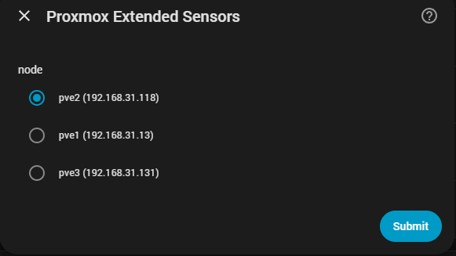

# 🔌 Étape 3 : Installation de l'Intégration dans Home Assistant

Pour visualiser toutes les données (températures, capteurs matériels, disques, PBS, VM et CT), nous utiliserons l'intégration **Proxmox Extended Sensors**.

---

## 1. Installation via HACS

Comme il s'agit d'une intégration personnalisée, vous devez d'abord l'ajouter à HACS :

1. Allez dans **HACS → Intégrations**
2. Cliquez sur les **trois points** (en haut à droite)
3. Sélectionnez **Dépôts personnalisés**
4. Ajoutez ce dépôt :
   `https://github.com/Javisen/proxmox_sensors/`
5. Dans **Catégorie**, sélectionnez `Intégration`
6. Installez l'intégration et **redémarrez Home Assistant**

---

## 2. Ajouter l'intégration

Après le redémarrage :

1. Allez dans **Paramètres → Appareils et Services**
2. Cliquez sur **Ajouter une intégration**
3. Recherchez **Proxmox Extended Sensors**

---

## 3. Configuration de la connexion

### 🔹 Hôte
- **Réseau local :** `192.168.1.50`
- **Accès externe :** `proxmox.mondomaine.com`

> Il n'est pas nécessaire d'inclure `http://` ou `https://`. Cela est détecté automatiquement.

---

### 🔹 Type de serveur
- **CLUSTER** → Cluster Proxmox
- **PVE** → Proxmox Virtual Environment
- **PBS** → Proxmox Backup Server

---

### 🔹 Méthode d'authentification

- **Utilisateur + mot de passe** → uniquement sur PVE et Cluster
- **Jeton API** → Obligatoire sur PBS

---

## 🔐 Option A : Utilisateur et mot de passe (PVE uniquement)

Champs :

- **Utilisateur :** `utilisateur@domaine`
  - Exemple : `homeassistant@pve`
- **Mot de passe :** mot de passe de l'utilisateur

> 💡 Depuis la V3, le nœud est détecté automatiquement. Il n'est pas nécessaire de le saisir manuellement.

---

## 🔐 Option B : Jeton API (recommandé)

Champs :

- **Utilisateur :** `utilisateur@domaine`
- **ID du jeton :** uniquement le nom → `ha-token`
- **Secret du jeton :** le secret généré dans Proxmox

> ⚠️ N'utilisez pas le format `utilisateur@pve!jeton`

---

## 🧠 Sélection des ressources (PVE)

Après la connexion, l'intégration détectera automatiquement les ressources disponibles.

Vous pourrez sélectionner :

- Machines virtuelles (VM)
- Conteneurs (CT)
- Disques physiques
- Stockages

> 💡 Sélectionnez uniquement ce qui est nécessaire pour garder Home Assistant propre et efficace.

---

## 🧭 Guide Visuel d'Installation

Voici le processus complet avec des captures d'écran :

  
🪪 Connexion au serveur

  

    
  

  
<i>Il n'est pas nécessaire d'inclure http/https.</i>

  
🪪 Connexion avec utilisateur et mot de passe (PVE)

  

    
  

  
<i>Utilisez le bon domaine (pam ou pve).</i>

  
🪪 Connexion avec jeton (PVE et PBS)

  

    
  

  
<i>Entrez uniquement le nom du jeton dans l'ID du jeton.</i>

  
🧠 Sélection des nœuds (V3)

  

    
  

  
<i>Les nœuds sont détectés automatiquement et peuvent être sélectionnés manuellement.</i>

  
⚙️ Sélection des ressources

  

    
  

---

## ⚠️ Note concernant PBS dans les environnements gérés

Si vous utilisez un PBS **géré ou multi-tenant** (Tuxis, Hetzner, etc.) :

- Vous n'aurez pas accès aux capteurs matériels
- Vous ne verrez ni températures ni disques physiques
- Il n'y aura pas de métriques de nœud

C'est normal car :

- Vous n'avez pas accès au matériel réel
- Le fournisseur restreint le système
- Il n'existe pas de permissions de bas niveau

**Résultat :**
Seules des données limitées du datastore seront affichées.

---