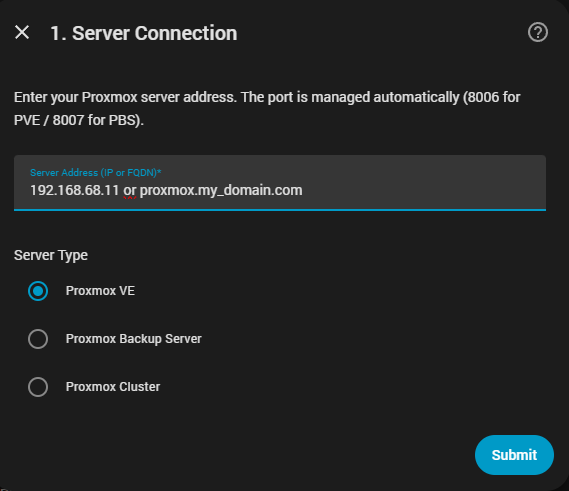
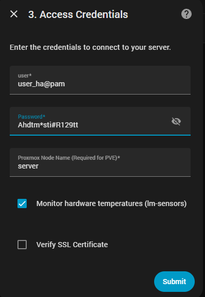
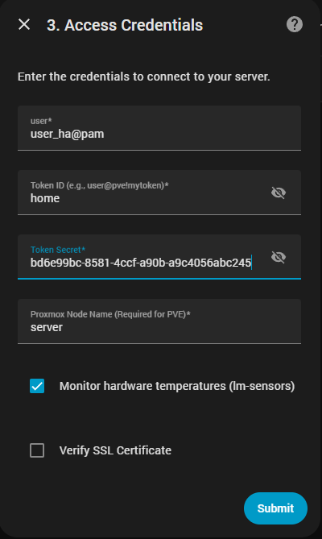
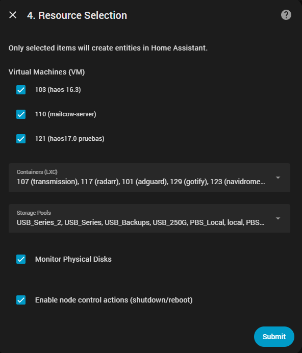

# 🔌 Étape 3 : Installation de l'Intégration dans Home Assistant

Pour visualiser les données (y compris les températures, les capteurs matériels, les disques, PBS, les VM et les CT), nous utiliserons l'intégration **Proxmox Extended Sensors**.

[Guide d'Installation Visuel](#-Guide-dInstallation-Visuel)

---

## 1. Installation via HACS

Étant une intégration personnalisée, nous devons d'abord l'ajouter à HACS :

1. Allez dans **HACS → Intégrations**  
2. Cliquez sur les **trois points** (en haut à droite)  
3. Sélectionnez **Dépôts personnalisés**  
4. Ajoutez ce dépôt : `https://github.com/Javisen/proxmox_sensors/`
5. Dans **Catégorie**, sélectionnez `Intégration`  
6. Installez-la et **redémarrez Home Assistant**

---

## 2. Configuration de l'Intégration

Après le redémarrage :

1. Allez dans **Paramètres → Appareils et Services**  
2. Cliquez sur **Ajouter une intégration**  
3. Recherchez **Proxmox Extended Sensors**

---

## 3. Données de Connexion

Le formulaire est simple, mais il y a des détails importants :

### 🔹 Hôte
- **Sur le réseau local :** uniquement l'IP → `192.168.1.50`  
*(Ne mettez pas de port ni http/https)*  
- **Depuis l'extérieur :** votre domaine → `proxmox.mondomaine.com`  
*(L'intégration détecte automatiquement http/https)*

### 🔹 Type de serveur
- **PVE** → Proxmox Virtual Environment  
- **PBS** → Proxmox Backup Server  

### 🔹 Méthode d'authentification
- **Connexion traditionnelle** (seulement PVE)  
- **Token API** (obligatoire pour PBS)

---

## 🔐 Option A : Connexion avec Utilisateur (sans Token)

Valable uniquement pour **PVE**.

Champs :

- **Utilisateur :** `utilisateur@realm`  
Exemples :  
- `homeassistant@pve`  
- `root@pam`  
- **Mot de passe :** le mot de passe de l'utilisateur  
- **Nom du nœud :** nom du nœud (tel qu'il apparaît dans Proxmox)

---

## 🔐 Option B : Connexion avec Token (recommandé et obligatoire pour PBS)

Champs :

- **Utilisateur :** `utilisateur@realm`  
- **token_id :** uniquement le nom du token → `ha-token`  
*(Ne mettez pas `utilisateur@pve!token`)*  
- **Token_secret :** le Secret généré par Proxmox  

---

## ✅ Sélection des Entités (seulement pour PVE)

Après la connexion, l'intégration analysera votre serveur et vous pourrez choisir ce que vous souhaitez surveiller :

- **VM**  
- **CT**  
- **Disques physiques**  
- **Stocks**

> [!TIP]  
> Sélectionnez uniquement ce dont vous avez besoin pour garder Home Assistant propre et rapide.

---

## 🧭 Guide d'Installation Visuel

**Ci-dessous, vous trouverez un parcours visuel complet du processus de configuration, incluant les méthodes de connexion, la sélection des ressources et les étapes de configuration.**

  
🪪 Capture : Connexion au Serveur

  

    
  

  > N'utilisez pas "http://" ou "https://". Nous le gérons déjà pour vous.

  
🪪 Capture : Connexion via Utilisateur et Mot de passe (seulement PVE)

  

    
  

  > Assurez-vous d'utiliser le realm `pam` ou `pve` selon la configuration de votre utilisateur.

 
  
🪪 Capture : Connexion via Utilisateur et Token (PVE et PBS)

  

    
  

  **Dans le champ Token_id, ne mettez que le nom du token**

  
⚙️ Capture : Sélection des Ressources

  

    
  

  *Note : Sélectionnez les CT, VM et Stocks que vous souhaitez ajouter ainsi que les options*

---

## ⚠️ Note importante pour PBS dans les environnements partagés (Tuxis, Hetzner, etc.)

Si vous utilisez un PBS **géré** ou **multi‑tenant**, comme Tuxis Free PBS :

- Vous ne verrez pas de capteurs matériels  
- Vous ne verrez pas de températures  
- Vous ne verrez pas de disques physiques  
- Vous ne verrez pas de métriques du nœud  

C'est normal car :

- Vous n'avez pas accès au matériel réel  
- Le fournisseur cache l'infrastructure  
- Vous n'avez pas les permissions root  
- Vous ne pouvez pas accéder au système de fichiers réel  

**Résultat :**  
L'intégration n'affichera que des capteurs vides ou aucune donnée.  
Dans les futures versions, nous essaierons d'afficher les métriques personnalisées du datastore.
